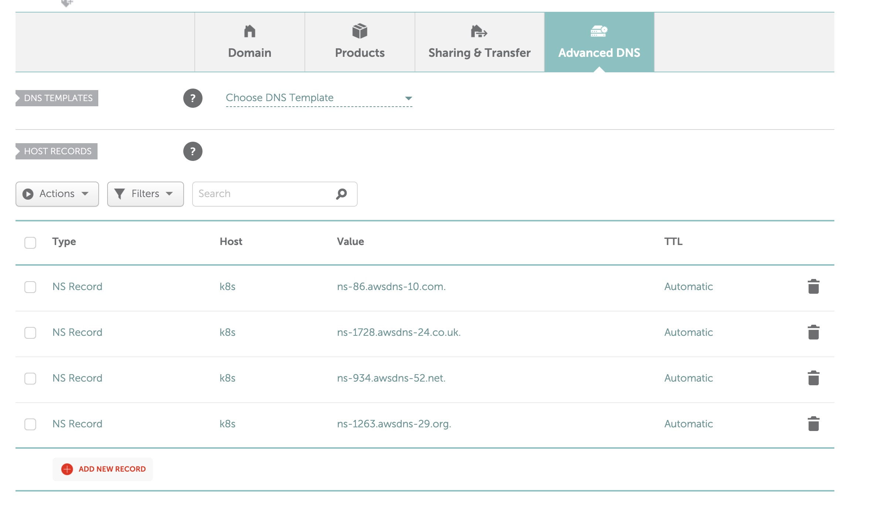

# Scope
1) Create hosted zone and subdomain
2) Points subdomain to parent hosted zone
3) Create kops state s3 bucket (private)
4) Terraform using local variables and functions
5) Pass terraform variables to kops CLI
6) Kops with EC2 keys


# Code

1) Apply terraform with `terraform apply` (This script essentially prepares stuff like in  [Scenario 1b](https://github.com/kubernetes/kops/blob/master/docs/getting_started/aws.md#scenario-1b-a-subdomain-under-a-domain-purchasedhosted-via-aws))
2) Output public ssh key into a file `terraform output kops-public-key > key.pub`
3) Optionally create RSA key with `ssh-keygen -f ./key`
4) Create kops cluster (public zone)
5) Point NS from registrar to AWS 


```
kops create cluster \
  --name=$(terraform output kops-domain) \
  --state=$(echo s3://$(terraform output kops-bucket)) \
  --zones=us-east-1a \
  --node-count=1 \
  --node-size=t3a.micro \
  --master-size=t3a.micro \
  --master-volume-size=8 \
  --node-volume-size=8 \
  --master-count=1 \
  --dns-zone=$(terraform output kops-domain) \
  --ssh-public-key=./key.pub
```

1) Configure reference
```
export NAME=$(terraform output kops-domain)
export KOPS_STATE_STORE=$(echo s3://$(terraform output kops-bucket))
```

7) Update cluster to deploy

```
kops update cluster --name ${NAME} --yes
```

8) Validate (Does take 10-15 minutes)


```
kops validate cluster --wait 10m
```

9) Get nodes

```
kubectl get nodes
```

## Optional Terraform (WIP):
(Seems to not create required A records in the hosted zone)

```
# Note Terraform fails to create dns records

kops create cluster \
  --name=$(terraform output kops-domain) \
  --state=$(echo s3://$(terraform output kops-bucket)) \
  --zones=us-east-1a \
  --node-count=1 \
  --node-size=t3a.micro \
  --master-size=t3a.micro \
  --master-volume-size=8 \
  --node-volume-size=8 \
  --master-count=1 \
  --out=./kops-tf \
  --dns-zone=$(terraform output kops-domain) \
  --target=terraform \
  --ssh-public-key=./key.pub
```

6) Navigate to kops terraform
   
```
cd ./kops-tf
terraform init
terraform plan
terraform apply
```

```
Run these commands to apply the configuration:
   cd ./kops-tf
   terraform plan
   terraform apply

Suggestions:
 * validate cluster: kops validate cluster --wait 10m
 * list nodes: kubectl get nodes --show-labels
 * ssh to the master: ssh -i ~/.ssh/id_rsa ubuntu@api.k8s.example.com
 * the ubuntu user is specific to Ubuntu. If not using Ubuntu please use the appropriate user based on your OS.
 * read about installing addons at: https://kops.sigs.k8s.io/operations/addons.
```

Delete cluster
```
kops delete cluster \
  --name=$(terraform output kops-zone)  \
  --state=$(echo s3://$(terraform output kops-bucket)) \
  --yes
```

Manage cluster
```
kops edit cluster \
 --name=$(terraform output kops-zone)  \
  --state=$(echo s3://$(terraform output kops-bucket)) 
```

Manage nodes
```
kops edit ig nodes \
 --name=$(terraform output kops-zone)  \
  --state=$(echo s3://$(terraform output kops-bucket)) 
```


## Updating Cluster with terraform 
  1) `kops edit cluster|ig nodes --name  --state` 
  2) `kops update cluster|nodes --name --state --target=terraform --out=./kops-tf`


# Notes:

- In namecheap you need to enable premium DNS
- Terraform deployment doesn't seem to create (api.*) A records in the hosted zone
- A records in Route53 you will point to 203.0.113.123. These are placeholder domains, and the master node will updated those when cluster is ready: https://github.com/kubernetes/kops/issues/1386#issuecomment-276789799

